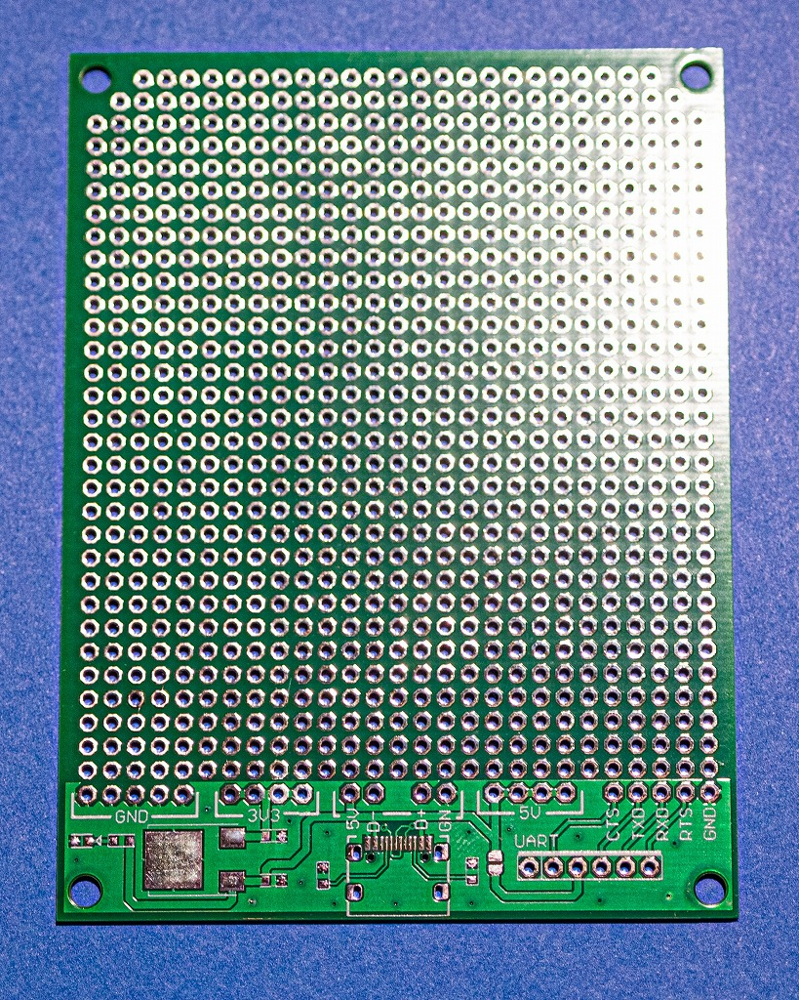
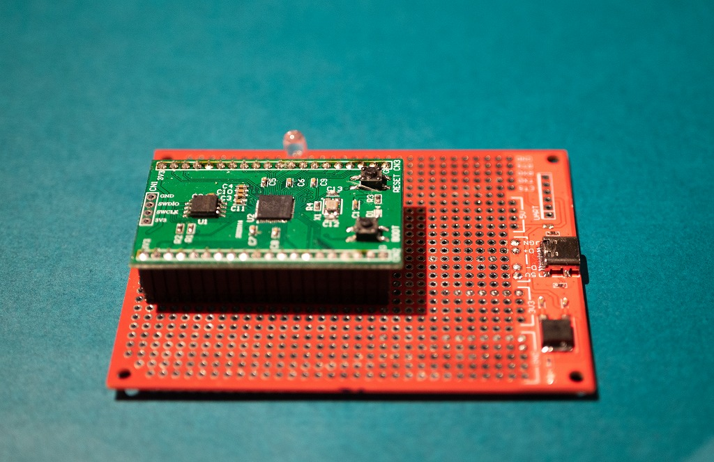

# AN-212 USB-TypeC ユニバーサル基板V1・緑(未実装)

# 商品説明

USB-TypeCケーブルを使って、5V電源とUSB2.0用通信を引き出したユニバーサル基板です。

秋月電子通商のBタイプ基板とサイズ互換があります。

CC端子に抵抗を取り付ける事が出来ますので、TypeCタイプの電源アダプタからも5Vを取得できます。

基板にはレギュレータもあり、3.3Vを取得する事が出来ます。

これにより3.3V系のマイコン開発が非常に楽になると思います。

 
# 仕様

- 基板サイズ
- パッド：両面スルーホール（1mm穴 2mmパッド）
- 基板厚：1.6mm
- ねじ穴:3.2mm　x4
- 追加機能：USB-TypeC　上下対応
- 　　　　　USB2.0規格対応
- 　　　　　CC端子に対応
- 　　　　　USB5Vを3.3V@800mAに変換
- 　　　　　FTDI系のシリアルケーブルを接続するポート付き

# 内容物

- 未実装基板　１枚

# 未実装部品について

当基板は未実装基板です。

以下の部品を実装する必要があります。

-  USB Type-Cコネクタ
-  CC端子用5.1KΩ 1608サイズ  （4.7KΩでも代用可能）
-  3.3V用レギュレータ  NJM2845DL1-33
-  レギュレータ用コンデンサ    0.1uF 1608サイズ
-  電源確認用LED   1608サイズ
-  LED用抵抗      4.7KΩ 1608サイズ

未実装の為、お安くしてあります。腕に自信がある方にお勧めです。

完成品は　AN-216 ～　AN-219 の商品になります。
 
# 使用例

# 資料s

- 回路図

- 外形寸法
